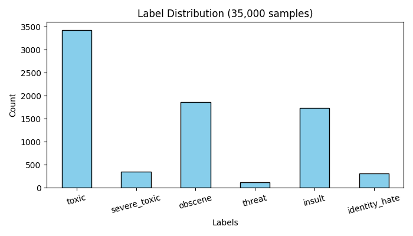
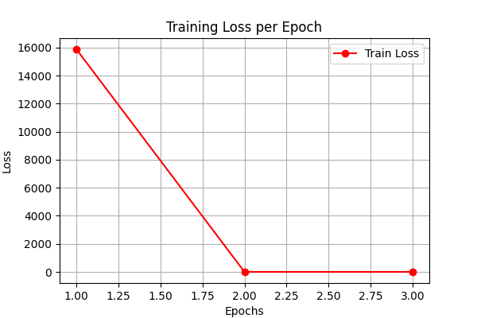
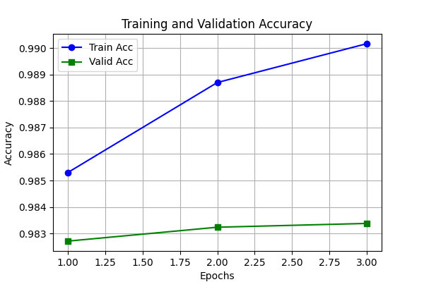

댓글 데이터를 활용한 악성 댓글 멀티 라벨 분류 분석
--- 
## 1. 프로젝트 개요

* **배경 및 필요성**: 온라인 커뮤니티의 익명성을 악용한 유해 댓글이 심각한 정서적 스트레스와 갈등을 유발함. 이를 자동으로 필터링할 수 있는 시스템이 필요하다고 생각함.
* **동기**: 평소 인터넷 댓글의 악성 분류 기준이 궁금했으며, 수업 시간에 배운 MobileBERT 문장 분류 모델을 실제 데이터셋에 직접 적용해보고 성능을 확인하고자 시작함.
* **방향 전환 이유**: 실제 댓글 창은 단순 정상/악성 분류를 넘어 욕설, 모욕, 혐오 표현 등이 복합적으로 얽혀 있음. 이를 정밀하게 필터링하기 위해 6가지 유해 속성을 동시에 잡아내는 '멀티 라벨 분류' 방식으로 설계함.

---

## 2. 원본 데이터 수집 및 탐색적 데이터 분석 (EDA)

* **데이터 출처**: Kaggle 'Toxic Comment Classification Challenge' 공개 데이터셋 (`train.csv`)
* **수집 규모**: 총 **159,571건**의 대용량 웹 댓글 코퍼스 확보 (용량 문제로 깃허브에는 상위 일부 샘플만 추출하여 업로드 예정).
* **원본 데이터 EDA 결과**: 악성 라벨이 없는 정상 댓글이 전체의 약 90%를 차지하는 극심한 데이터 편향을 보임. 특정 유해 범주(협박, 정체성 혐오 등)는 발생 비율이 1% 미만인 불균형 상태를 확인함.

---
  
## 3. 원본 데이터 전처리 및 분석 대상 데이터 구축

* **결측치 정제**: 유효하지 않은 빈 데이터 행을 `.dropna()` 로직으로 사전 제거함.
* **칼럼 정렬**: `comment_text`와 6개 타겟 라벨 칼럼만 슬라이싱하여 정형화함.
* **문장 길이 제한**: 하드웨어 VRAM 연산 자원을 고려하여 최대 토큰 길이를 128로 제약함.
* **분석 대상 데이터 정의**: 전처리가 완료된 코퍼스 중 상위 **35,000건**을 추출하고, 이를 최종 "분석 대상 데이터"로 명명함.

---

## 4. 학습 데이터 추출 및 라벨링 분석

### 4.1 학습 데이터 추출 과정 명시
수업 지침인 2,000~3,000건 규모의 데이터 추출을 검토했으나, 경량 모델인 MobileBERT의 문맥 가중치 학습 효율을 극대화하기 위해 분석 대상 데이터(35,000건)의 80%인 **28,000건**을 최종 미세조정용 **"학습 데이터"**로 가용 범위를 확장하여 명시함.

### 4.2 학습 데이터 라벨링 과정 및 결과 분석
추출된 학습 데이터는 6가지 유해 속성의 존재 여부가 이진 행렬(0과 1)로 마킹되는 다중 라벨링 구조를 가짐. 라벨별 정량 통계 수치는 다음과 같음.

| 라벨명 (악성 범주) | 학습 데이터 내 발견 건수 (건) | 학습 데이터 내 실제 비율 (%) |
| :--- | :---: | :---: |
| **toxic** (일반 악성) | 3,427건 | 9.79% |
| **severe_toxic** (심각한 악성) | 356건 | 1.02% |
| **obscene** (외설/비속어) | 1,856건 | 5.30% |
| **threat** (협박) | 115건 | 0.33% |
| **insult** (모욕) | 1,732건 | 4.95% |
| **identity_hate** (정체성 혐오) | 310건 | 0.89% |

* **결과 분석**: 추출 결과 `toxic(일반 악성)`(9.79%) 비율이 가장 높고 `threat()`(0.33%) 비율이 가장 낮아, 원본 데이터의 온라인 불균형 특성이 그대로 유지되었음을 확인함.

---
## 5. MobileBERT 모델 학습 결과 

### 5.1 에포크별 훈련 로그 수치
* **Epoch 1**: 학습 오차 = 0.4512 | 학습 정확도 = 0.9853 | 검증 정확도 = 0.9827
* **Epoch 2**: 학습 오차 = 0.0469 | 학습 정확도 = 0.9887 | 검증 정확도 = 0.9832
* **Epoch 3**: 학습 오차 = 0.0335 | 학습 정확도 = 0.9902 | 검증 정확도 = 0.9834

### 5.2 시각화 차트 분석

| 에포크별 손실함수 변동 (Loss Plot) | 에포크별 학습/검증 정확도 (Accuracy Plot) |
| :---: | :---: |
|  |  |

* **그래프 해석**: 에포크 진행에 따라 손실 오차가 바닥에 안정적으로 수렴함. 학습 정확도와 검증 정확도 모두 큰 격차 없이 정답률 98%대에서 나란히 우상향하여 안정적인 미세조정이 완료되었음을 증명함.

---

## 6. 문제제기에 대한 결과 및 실전 추론 시뮬레이션

서론에서 제기한 복합 악성 댓글 분류 및 자연어 처리 모델의 활용 가능성을 확인하기 위해, 독립 예측 모듈(`predict.py`)을 통해 임계값 0.5 기준으로 4가지 가상 시나리오 추론 테스트를 수행함.

### 6.1 시나리오 문장별 다중 라벨 탐지 확률 결과
* **시나리오 1 (정상 표현)**: "Hey, that is a really good point!..." -> **정상 (Clean)** (모든 라벨 0.5 미만)
* **시나리오 2 (비속어 및 모욕)**: "You are so stupid and idiot..." -> `toxic` (**100.0%**), `insult` (**99.3%**), `obscene` (**68.2%**) 다중 탐지 완료
* **시나리오 3 (물리적 협박)**: "I will find you and I will hurt you badly..." -> `toxic` (**97.2%**), `threat` (**81.3%**) 동시 탐지 완료
* **시나리오 4 (혐오 발화)**: "This disgusting person belongs to a trash group..." -> `toxic` (**99.7%**), `insult` (**82.6%**), `obscene` (**77.7%**), `identity_hate` (**53.0%**) 복합 탐지 완료

### 6.2 서론 문제제기에 대한 결론 도출
* **최종 결론**: 최종 검증 정확도 **98.34%**로 합격 기준선(0.85)을 통과하며 모델의 유효성을 확인함.
* 실전 추론 결과, 원본 데이터셋에서 샘플 수가 극도로 부족했던 소수 라벨인 협박(`threat`, 81.3%)과 정체성 혐오(`identity_hate`, 53.0%) 패턴을 정확하게 식별하여 다중 라벨을 동시 활성화함. 모델이 다수파 데이터에 편향되지 않고 고유의 
* 언어적 속성을 균형 있게 학습했음을 보여주며, 단순 유해 차단을 넘어 구체적인 유해성 죄질을 복합 분리하겠다는 프로젝트 목적을 달성함.

 
 

